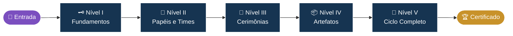
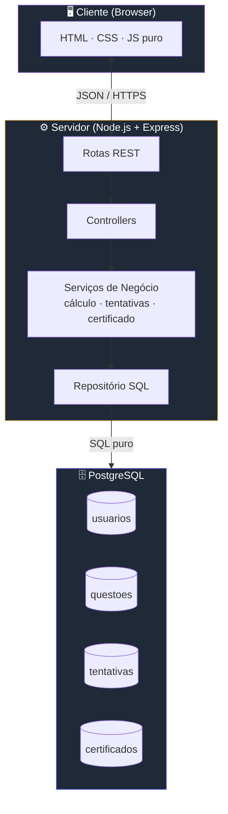
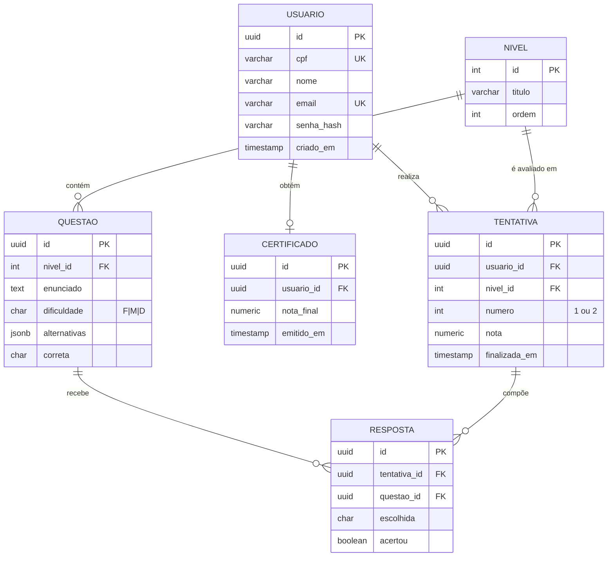

<div align="center">


<br><br>

**Um RPG educativo onde as regras do jogo são as regras do Scrum.**

<br>

[](https://github.com/octopusCode26/ABP_DSM1_)
[](https://www.figma.com/design/96DMn9UVu2MT9xJIi5pBiQ/Prototipo_Scrum-Dungeon)
[](https://github.com/users/octopusCode26/projects/8)


</div>

<br>

> *"Aventureiro... os segredos do Scrum Master aguardam além desta porta. Você tem coragem de enfrentar a dungeon?"*
>
> — **O Corvo**

---

## 📖 Sumário

1. [Sobre o Projeto](#-sobre-o-projeto)
2. [Como Funciona](#-como-funciona)
3. [Arquitetura](#-arquitetura)
4. [Tecnologias](#-tecnologias)
5. [Estrutura do Projeto](#-estrutura-do-projeto)
6. [Como Executar](#-como-executar)
7. [Modelo de Dados](#-modelo-de-dados)
8. [Sprints](#-sprints)
9. [Requisitos](#-requisitos)
10. [Definition of Done](#-definition-of-done)
11. [Os Aventureiros](#-os-aventureiros)

---

<a id="-sobre-o-projeto"></a>
## 🏰 Sobre o Projeto

**Scrum Dungeon** é o projeto integrador (ABP) do 1º semestre de **Desenvolvimento de Software Multiplataforma — FATEC Jacareí**, sob orientação do **Prof. Antonio Egydio São Thiago Graça** e acompanhamento do **Prof. Marcelo Augusto Sudo**.

A premissa: **ensinar Scrum vivenciando Scrum.** Em vez de memorizar definições, o jogador atravessa uma dungeon de cinco níveis onde cada mecânica reflete um conceito do framework — papéis, cerimônias, artefatos e fluxo. As regras do jogo são as regras do Scrum.

O grupo **Octopus Code** entrega o produto em três sprints, aplicando na prática a metodologia que o jogo ensina.

**Objetivos pedagógicos**

| Eixo | Conceitos abordados |
|------|--------------------|
| Fundamentos | Pilares (transparência, inspeção, adaptação), valores, manifesto ágil |
| Papéis | Product Owner, Scrum Master, Dev Team |
| Cerimônias | Sprint Planning, Daily, Review, Retrospective |
| Artefatos | Product Backlog, Sprint Backlog, Increment, DoD |
| Fluxo | Sprint completa do refinamento à entrega |

---

<a id="-como-funciona"></a>
## ⚔️ Como Funciona

A dungeon tem cinco níveis sequenciais. O jogador só avança ao demonstrar domínio do nível anterior.



### 📜 Regras da Dungeon

| Regra | Detalhe |
|-------|---------|
| Banco por nível | 30 questões |
| Sorteio por tentativa | 10 questões (3 fáceis · 4 médias · 3 difíceis) |
| Tentativas | Até 2 por nível |
| Nota do nível | Maior entre as tentativas |
| Resultado final | Média aritmética das notas dos 5 níveis |
| Recompensa | Certificado digital ao concluir todos os níveis |

### 🧮 Cálculo da Nota Final

$$
\text{Nota Final} = \frac{1}{5} \sum_{i=1}^{5} \max(t_{i,1},\ t_{i,2})
$$

Onde $t_{i,j}$ é a pontuação da tentativa $j$ no nível $i$.

---

<a id="-arquitetura"></a>
## 🏛️ Arquitetura

Aplicação **monolítica em três camadas**, com toda a lógica de negócio no servidor. O front consome uma API REST do back; o back é a única fronteira que fala com o banco.



**Princípios arquiteturais**

- **Server-authoritative.** Cliente nunca decide nota, tentativa ou aprovação. RP-04.
- **Sem ORM.** SQL escrito à mão, com prepared statements. Auditoria e desempenho explícitos.
- **Sem framework de UI.** Stack didática — força o aluno a entender o DOM. RP-01.
- **Stateless onde possível.** Sessão via cookie httpOnly assinado.

---

<a id="-tecnologias"></a>
## 🧰 Tecnologias

<div align="center">

</div>

| Camada | Ferramenta | Por quê |
|--------|------------|---------|
| Front-end | HTML5, CSS3, JavaScript ES6+ | Restrição pedagógica (RP-01) |
| Back-end | Node.js + Express | Rotas REST, middleware de auth |
| Banco | PostgreSQL 14+ | DDL/DML explícitos (RP-02) |
| Versionamento | Git Flow adaptado + PR | Revisão obrigatória (RP-05) |
| Design | Figma | Prototipação de telas e fluxos |
| Gestão | GitHub Projects (Kanban) | Backlog e sprints |

---

<a id="-estrutura-do-projeto"></a>
## 📁 Estrutura do Projeto

```
ABP_DSM1_/
├── public/                  # Estáticos servidos pelo Express
│   ├── css/
│   ├── js/
│   ├── img/
│   └── pages/               # Telas (login, niveis, certificado)
├── src/
│   ├── routes/              # Definição das rotas REST
│   ├── controllers/         # Recebe req/res, valida entrada
│   ├── services/            # Regras de negócio (nota, tentativas)
│   ├── repositories/        # SQL puro (queries parametrizadas)
│   ├── middlewares/         # Auth, logger, error handler
│   └── config/              # Conexão DB, env
├── database/
│   ├── ddl/                 # CREATE TABLE, índices, constraints
│   ├── dml/                 # INSERT do banco de questões
│   └── migrations/          # Scripts versionados
├── docs/
│   ├── diagrams/            # Casos de uso, classe, sequência
│   └── api.md               # Contrato das rotas
├── .env.example
├── package.json
└── README.md
```

---

<a id="-como-executar"></a>
## 🚀 Como Executar

### Pré-requisitos

| Ferramenta | Versão mínima |
|------------|---------------|
| Node.js | 18 LTS |
| npm | 9 |
| PostgreSQL | 14 |
| Git | 2.40 |

### Passo a passo

```bash
# 1. Clonar
git clone https://github.com/octopusCode26/ABP_DSM1_.git
cd ABP_DSM1_

# 2. Instalar dependências
npm install

# 3. Configurar variáveis de ambiente
cp .env.example .env
# edite .env com suas credenciais
```

Conteúdo mínimo do `.env`:

```env
# Servidor
PORT=3000
NODE_ENV=development
SESSION_SECRET=troque-isto-em-producao

# Banco
DB_HOST=localhost
DB_PORT=5432
DB_USER=postgres
DB_PASSWORD=sua_senha
DB_NAME=scrum_dungeon
```

```bash
# 4. Criar o banco e aplicar schema
createdb scrum_dungeon
psql -d scrum_dungeon -f database/ddl/schema.sql
psql -d scrum_dungeon -f database/dml/seed_questoes.sql

# 5. Subir a aplicação
npm start
```

Acesse **http://localhost:3000**.

> ⚠️ Os scripts SQL ficam em `database/`. À medida que as sprints avançam, novos arquivos de migração serão adicionados — execute-os em ordem.

---

<a id="-modelo-de-dados"></a>
## 🗄️ Modelo de Dados



**Constraints críticas**

- `tentativa.numero` ∈ {1, 2} — restringido por `CHECK`.
- Único `(usuario_id, nivel_id, numero)` em `tentativa`.
- Único `usuario_id` em `certificado` (1 certificado por aventureiro).

---

<a id="-sprints"></a>
## 🕰️ Sprints

| Sprint | Período | Entregas | Status |
|--------|---------|----------|--------|
| **Sprint 1** | 13/04 — 30/04/2026 | Prototipação · UML · Arquitetura · Nível 1 | 🔄 Em andamento |
| **Sprint 2** | 04/05 — 21/05/2026 | Cadastro · Login · Banco de questões · Avaliação | ⏳ Aguardando |
| **Sprint 3** | 25/05 — 11/06/2026 | Certificado · Histórico · Resultado final | ⏳ Aguardando |
| **Apresentação** | 22/06/2026 | Demonstração na FATEC Jacareí | ⏳ Aguardando |

<details>
<summary><b>📌 Sprint 1 — Backlog detalhado</b></summary>

<br>

| Tarefa | Responsáveis | Iniciada | Concluída |
|--------|--------------|:--------:|:---------:|
| Prototipação (Figma) | Renan, Enzo, Thiago, Vitor | ✅ | — |
| Diagrama de Caso de Uso | Alef | ✅ | ✅ |
| Organizar Ambiente Virtual | Lorenzo | ✅ | ✅ |
| Definição de Conteúdo | Vitor | ✅ | ✅ |
| Organizar Arquitetura | Cauã, Igor, Lorenzo | ✅ | ✅ |
| Diagrama de Classe | Igor, Lorenzo | ✅ | ✅ |
| Nível 1 (Front-end) | Renan, Thiago, Cauã, Enzo | ✅ | — |
| Diagramas de Sequência | Vitor, Lorenzo, Igor | ✅ | ✅ |

</details>

---

<a id="-requisitos"></a>
## 📜 Requisitos

<details>
<summary><b>Funcionais (RF)</b></summary>

<br>

| ID | Requisito |
|----|-----------|
| RF-01 | Cadastro com CPF, nome, e-mail e senha |
| RF-02 | Login por CPF e senha |
| RF-03 | Sorteio de 10 questões por nível (banco de 30) |
| RF-04 | Questões em três dificuldades: fácil, médio, difícil |
| RF-05 | Composição: 3 fáceis · 4 médias · 3 difíceis |
| RF-06 | Máximo de 2 tentativas por nível |
| RF-07 | Nota do nível = maior entre as tentativas |
| RF-08 | Resultado final = média das notas por nível |
| RF-09 | Certificado digital com nome, CPF, e-mail, data e notas |
| RF-10 | Histórico de tentativas com data, hora e pontuação |
| RF-11 | Consulta de progresso em tempo real |
| RF-12 | *(Opcional)* Área administrativa de questões |

</details>

<details>
<summary><b>Não funcionais (RNF)</b></summary>

<br>

| ID | Requisito |
|----|-----------|
| RNF-01 | Interface simples, clara e responsiva |
| RNF-02 | Tempo de resposta adequado |
| RNF-03 | Conformidade com a LGPD |
| RNF-04 | Notas e tentativas não manipuláveis via front-end |
| RNF-05 | Backlog, sprints, versionamento e DoD documentados |
| RNF-06 | Documentação mínima: modelo de dados, rotas e instruções |

</details>

<details>
<summary><b>Restrições de Projeto (RP)</b></summary>

<br>

| ID | Restrição |
|----|-----------|
| RP-01 | Front-end exclusivamente em HTML, CSS e JS puro — sem frameworks |
| RP-02 | Banco PostgreSQL com DDL/DML explícitos — sem ORM |
| RP-03 | Entrega funcional dentro das 3 sprints |
| RP-04 | Lógica de negócio reside no back-end |
| RP-05 | Versionamento Git Flow adaptado, com Pull Request aprovado |

</details>

---

<a id="-definition-of-done"></a>
## ✅ Definition of Done

Uma tarefa só é considerada **Pronta** quando:

- [ ] Código revisado por ao menos um par via Pull Request
- [ ] Atende aos critérios de aceite da User Story
- [ ] Sem erros no console (front e back)
- [ ] SQL com queries parametrizadas (sem concatenação de string)
- [ ] Documentação atualizada (rotas, schema, README quando aplicável)
- [ ] Mergeado em `develop` sem conflitos
- [ ] Testado em ambiente local pelo PO ou Scrum Master

---

<a id="-os-aventureiros"></a>
## 👥 Os Aventureiros

<div align="center">


**`< OCTOPUS_CODE >;`**

<br>

<table>
  <tr>
    <td align="center">
      <a href="https://github.com/VtecturboBr">
        <br>
        <sub><b>Alef Oliveira</b></sub>
      </a><br><sub>🛡️ Desenvolvedor</sub>
    </td>
    <td align="center">
      <a href="https://github.com/Cauaisq">
        <br>
        <sub><b>Cauã Silva</b></sub>
      </a><br><sub>🛡️ Desenvolvedor</sub>
    </td>
    <td align="center">
      <a href="https://github.com/EnzoSuzukiProkopas">
        <br>
        <sub><b>Enzo Prokopas</b></sub>
      </a><br><sub>🛡️ Desenvolvedor</sub>
    </td>
    <td align="center">
      <a href="https://github.com/igoriansen">
        <br>
        <sub><b>Igor Iansen</b></sub>
      </a><br><sub>🛡️ Desenvolvedor</sub>
    </td>
  </tr>
  <tr>
    <td align="center">
      <a href="https://github.com/LorenzoOMN">
        <br>
        <sub><b>Lorenzo Nogueira</b></sub>
      </a><br><sub>🧙 Scrum Master</sub>
    </td>
    <td align="center">
      <a href="https://github.com/renanrmsantos14">
        <br>
        <sub><b>Renan Santos</b></sub>
      </a><br><sub>🛡️ Desenvolvedor</sub>
    </td>
    <td align="center">
      <a href="https://github.com/thiagosantos-17">
        <br>
        <sub><b>Thiago Santos</b></sub>
      </a><br><sub>🛡️ Desenvolvedor</sub>
    </td>
    <td align="center">
      <a href="https://github.com/vitorhirch">
        <br>
        <sub><b>Vitor Hirch</b></sub>
      </a><br><sub>👑 Product Owner</sub>
    </td>
  </tr>
</table>

</div>

---

<div align="center">


<br>

*"A dungeon foi conquistada. Até a próxima jornada."*

<br>

`1DSM` · `FATEC Jacareí` · `2026.1`

<sub>Projeto acadêmico — uso educacional.</sub>

</div>
